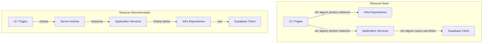

# Plano de Melhorias - Pastoreio Front

---

## Prioridade 1: Bugs Criticos (Codigo quebrado em producao)

Estes sao erros que impedem funcionalidades inteiras de funcionar.

### 1.1 Import errado em `useOrganograma.ts` (RESOLVIDO)

- **Arquivo:** [src/app/(private)/organograma/hooks/useOrganograma.ts](src/app/(private)/organograma/hooks/useOrganograma.ts)
- **Problema:** Linha 3 importa de `"flex"` ao inves de `"react"`. Isso faz toda a pagina de organograma crashar.
- **Correcao:** Trocar `from "flex"` por `from "react"`.

### 1.2 Variavel com nome errado em `useTopAlignedViewport.ts` (RESOLVIDO)

- **Arquivo:** [src/app/(private)/organograma/hooks/useTopAlignedViewport.ts](src/app/(private)/organograma/hooks/useTopAlignedViewport.ts)
- **Problema:** Na linha ~55, a variavel eh declarada como `centeredX` mas usada como `centerX`. Causa `ReferenceError` em runtime.
- **Correcao:** Renomear `centerX` para `centeredX` (ou vice-versa).

### 1.3 Typo na pagina do organograma (RESOLVIDO)

- **Arquivo:** [src/app/(private)/organograma/page.tsx](src/app/(private)/organograma/page.tsx)
- **Problema:** Linha ~63 contem `{!mo loading` ao inves de `{!loading`. Causa erro de compilacao.
- **Correcao:** Remover `mo` espurio.

### 1.4 Label errado para Auxiliar de Celula (RESOLVIDO)

- **Arquivo:** [src/app/(private)/membros/lib/getFuncaoLabel.ts](src/app/(private)/membros/lib/getFuncaoLabel.ts)
- **Problema:** `AUXILIAR_CELULA` esta mapeado para `"membroSelecionado"` (nome de variavel copiado por engano) ao inves de `"Auxiliar de Celula"`.
- **Correcao:** Trocar para `"Auxiliar de Celula"`.

### 1.5 Seletor CSS invalido em `ReceiveCode.tsx` (RESOLVIDO)

- **Arquivo:** [src/app/(public)/components/ReceiveCode.tsx](src/app/(public)/components/ReceiveCode.tsx)
- **Problema:** Seletor CSS `"& . .MuiOutlinedInput-input"` contem um espaco extra, fazendo o estilo nao ser aplicado.
- **Correcao:** Remover o espaco: `"& .MuiOutlinedInput-input"`.

---

## Prioridade 2: Ajustes de Arquitetura (AGENTS.md)

Com as decisoes arquiteturais aprovadas, os ajustes restantes deixam de ser sobre "proibir application -> infra" e passam a ser sobre manter os limites corretos entre UI, services, repositories e Supabase.

### 2.1 Concessao oficial: `application` pode chamar `infra` diretamente (RESOLVIDO POR DECISAO ARQUITETURAL)

**Decisao tomada:** neste projeto, a camada de `application` pode importar e chamar repositórios concretos de `infra/` diretamente quando isso simplificar o entendimento para um time com muitos devs juniores.

**Limite dessa concessao:** o `domain` continua isolado e nao deve conhecer `infra`, Supabase, Next.js ou React. A UI tambem continua sem poder instanciar repositórios diretamente.

**Arquivos que passam a ser considerados validos dentro dessa regra:**

- [src/modules/celulas/application/encontro.service.ts](src/modules/celulas/application/encontro.service.ts) - importa `EncontroRepository` de `../infra/`
- [src/modules/celulas/application/membros-celula.service.ts](src/modules/celulas/application/membros-celula.service.ts) - importa `MembrosCelulaRepository` de `../infra/`
- [src/modules/secretaria/application/membro.service.ts](src/modules/secretaria/application/membro.service.ts) - importa `MembroRepository` de `../infra/`

**Como fica a regra daqui para frente:**

1. `application` pode depender de repositórios concretos da mesma feature
2. `infra` continua sendo o lugar de acesso a banco e integrações externas
3. Interfaces passam a ser opcionais, usadas apenas quando houver benefício claro
4. A composicao principal continua preferencialmente em `app/actions/` ou adapters equivalentes

### 2.2 `usuario.service.ts` deveria delegar persistencia a repository (RESOLVIDO)

- **Arquivo:** [src/modules/controleacesso/application/usuario.service.ts](src/modules/controleacesso/application/usuario.service.ts)
- **Problema:** Mesmo com a concessao `service -> repository`, o service ainda acessa Supabase diretamente via `createClient()` e monta queries dentro da camada de `application`. Isso espalha regra de persistencia fora de `infra/`. Tambem usa `getSession()` que eh inseguro (pode ser spoofado via localStorage).
- **Resolucao aplicada:**
  1. Criado `modules/controleacesso/infra/usuario.repository.ts`
  2. A persistencia de perfil foi movida para o repository
  3. O service passou a depender diretamente desse repository concreto
  4. `getSession()` foi trocado por `getUser()`

### 2.3 `auth.service.ts` deveria delegar persistencia a repository (RESOLVIDO)

- **Arquivo:** [src/modules/controleacesso/application/auth.service.ts](src/modules/controleacesso/application/auth.service.ts)
- **Problema:** O service recebe `SupabaseClient` e executa queries diretamente. O problema aqui nao eh falar com `infra`, e sim pular o repository e falar com o cliente tecnico dentro de `application`.
- **Resolucao aplicada:** As queries de perfil e membro foram extraidas para repositories em `modules/controleacesso/infra/`, e o service passou a orquestrar esses repositories sem executar queries diretamente.

### 2.4 UI instancia repositorios e services diretamente (RESOLVIDO)

**Arquivos afetados:**

- [src/app/(private)/encontros/page.tsx](src/app/(private)/encontros/page.tsx) - linhas ~50-52: `new EncontroRepository()`, `new EncontroService(repo)`
- [src/app/(private)/encontros/hooks/useEncontros.ts](src/app/(private)/encontros/hooks/useEncontros.ts) - linhas ~30-31: mesma instanciacao

**Por que eh problema?** A UI nao deve conhecer repositorios nem instanciar services. Isso acopla a camada de apresentacao diretamente a infraestrutura.

**Resolucao aplicada:** Foram criadas Server Actions em `app/actions/encontros/`, e a UI de encontros deixou de instanciar `EncontroRepository` e `EncontroService` diretamente.

### 2.5 Hooks fora do local correto (RESOLVIDO POR DECISAO ARQUITETURAL)

**Decisao tomada:** hooks especificos de uma unica feature podem permanecer co-localizados com a propria feature.

**Como fica a regra daqui para frente:**

1. Hooks compartilhados entre features continuam em `ui/hooks/`
2. Hooks exclusivos de uma feature podem ficar em `app/.../hooks/` ou em outra pasta da propria feature
3. O importante eh manter escopo claro e evitar mover para `ui/hooks/` algo que nao eh reutilizavel

### 2.6 `modules/controleacesso/infra` ainda esta incompleto (RESOLVIDO)

- **Problema:** O modulo ja possui `infra/`, mas hoje ela ainda nao concentra os repositories necessarios para autenticação e perfil. Parte relevante do acesso a dados continua espalhada em `application/`.
- **Resolucao aplicada:** `modules/controleacesso/infra/` foi expandido com repositories de perfil e usuario, concentrando a persistencia e deixando `application/` com foco maior em orquestracao.

---

## Prioridade 3: Performance e SSR

### 3.1 Root Layout como Client Component (RESOLVIDO)

- **Arquivo:** [src/app/layout.tsx](src/app/layout.tsx)
- **Problema:** `"use client"` no root layout faz TODA a aplicacao virar Client Component. Isso:
  - Impede o uso da Metadata API do Next.js (SEO, titulo, descricao)
  - Desabilita Server-Side Rendering para toda a arvore
  - Aumenta o bundle JS enviado ao browser
- **Resolucao aplicada:**
  1. O `"use client"` foi removido de `src/app/layout.tsx`
  2. Os providers client-side foram extraidos para `src/app/providers.tsx`
  3. O layout raiz passou a importar `Providers`
  4. O layout privado passou a usar um shell client dedicado em `src/ui/components/layout/PrivateShell.tsx`

**Auditoria adicional de fronteiras client/server:**

#### 3.1.1 `app/(private)/layout.tsx` tambem pode voltar a Server Component (RESOLVIDO)

- **Arquivo:** [src/app/(private)/layout.tsx](src/app/(private)/layout.tsx)
- **Problema:** O layout privado virou client apenas para controlar `mobileOpen` e conectar `Header` + `Sidebar`.
- **Resolucao aplicada:**
  1. `app/(private)/layout.tsx` voltou a ser Server Component
  2. A parte interativa foi extraida para `PrivateShell.tsx`
  3. O estado do drawer ficou concentrado nesse shell
- **Beneficio:** reduz a fronteira client do layout privado e deixa a estrutura da rota mais alinhada ao App Router.

#### 3.1.2 `PageContainer.tsx` hoje propaga uma fronteira client desnecessariamente ampla (PARCIALMENTE RESOLVIDO)

- **Arquivo:** [src/ui/components/pages/PageContainer.tsx](src/ui/components/pages/PageContainer.tsx)
- **Problema:** O wrapper inteiro virou client por causa de `ProtectedRoute` e `react-helmet-async`, fazendo varias pages cruzarem a fronteira client mesmo quando a parte estrutural poderia ser server-safe.
- **Resolucao aplicada:**
  1. `react-helmet-async` foi removido do `PageContainer`
  2. O componente passou a atualizar `title` e `description` sem Helmet
  3. As pages server `dashboard` e `multiplicacao` deixaram de depender de `PageContainer` e passaram a usar metadata nativa
- **Observacao:** o wrapper ainda permanece client para os casos em que `ProtectedRoute` continua sendo client-side.

#### 3.1.3 `not-found.tsx` nao precisa ser Client Component (RESOLVIDO)

- **Arquivo:** [src/app/not-found.tsx](src/app/not-found.tsx)
- **Problema:** O arquivo usa `"use client"` sem hooks, browser APIs ou interacoes que exijam execucao no navegador.
- **Resolucao aplicada:** `"use client"` foi removido e a pagina ficou como Server Component.
- **Beneficio:** ganho simples e seguro, com menos hidratacao sem impacto funcional.

#### 3.1.4 Demais componentes auditados

- **Manter como client por enquanto:** `Header.tsx`, `Sidebar.tsx`, `Profile.tsx`, `UserProfileDialog.tsx`, `AuthProvider.tsx`, `ProtectedRoute.tsx`, as pages interativas de `membros`, `encontros`, `organograma` e os componentes publicos de autenticacao.
- **Motivo:** todos eles possuem estado local, efeitos, navegação, auth reativa, handlers de evento ou APIs de browser; nao ha ganho claro em forcar conversao agora.

### 3.2 Remover `react-helmet-async` (RESOLVIDO)

- **Arquivo:** [src/ui/components/pages/PageContainer.tsx](src/ui/components/pages/PageContainer.tsx)
- **Problema:** Usa `react-helmet-async` para titulo/descricao quando Next.js tem API nativa (`metadata` export ou `generateMetadata`).
- **Resolucao aplicada:** `react-helmet-async` foi removido do root layout e do `PageContainer`. As pages server passaram a usar metadata nativa, e o `PageContainer` passou a ajustar `document.title` e meta description no client.

### 3.3 Logica duplicada no `useEncontros.ts` (RESOLVIDO)

- **Arquivo:** [src/app/(private)/encontros/hooks/useEncontros.ts](src/app/(private)/encontros/hooks/useEncontros.ts)
- **Problema:** A funcao `refetch` e o `useEffect` tem logica identica duplicada (~40 linhas). Isso dificulta manutencao e eh propenso a bugs.
- **Resolucao aplicada:** o `useEffect` passou a chamar `refetch()`, removendo a duplicacao da logica de carregamento.

### 3.4 Falta de memoizacao em `useMembroSelecionado.ts` (RESOLVIDO)

- **Arquivo:** [src/app/(private)/membros/hooks/useMembroSelecionado.ts](src/app/(private)/membros/hooks/useMembroSelecionado.ts)
- **Problema:** `membrosVisiveis` eh recalculado a cada render (`.filter()` cria novo array). Isso causa re-execucao desnecessaria dos `useEffect` que dependem dele.
- **Resolucao aplicada:** `membrosVisiveis` passou a ser memoizado com `useMemo`.

---

## Prioridade 4: Codigo Duplicado

### 4.1 Funcao `getInitials()` duplicada (RESOLVIDO)

- **Arquivos:**
  - [src/ui/components/header/Profile.tsx](src/ui/components/header/Profile.tsx) (linha 66)
  - [src/ui/components/header/UserProfileDialog.tsx](src/ui/components/header/UserProfileDialog.tsx) (linha 43)
- **Resolucao aplicada:** A funcao foi extraida para `src/ui/utils/getInitials.ts` e passou a ser reutilizada por `Profile.tsx` e `UserProfileDialog.tsx`.

### 4.2 Componentes `LoadingBox` e `ErrorBox` duplicados (RESOLVIDO)

- `app/(private)/encontros/components/loading/LoadingBox.tsx`
- `app/(private)/encontros/components/error/ErrorBox.tsx`
- `app/(private)/membros/components/loading/LoadingBox.tsx`
- `app/(private)/membros/components/error/ErrorBox.tsx`
- **Resolucao aplicada:** Os componentes foram centralizados em `src/ui/components/feedback/LoadingBox.tsx` e `src/ui/components/feedback/ErrorBox.tsx`, e as duplicacoes antigas foram removidas.

### 4.3 Layout de paginas publicas duplicado (RESOLVIDO)

- Os arquivos `login/page.tsx`, `register/page.tsx`, `forgot-password/page.tsx`, `reset-password/page.tsx` tem estrutura identica (Box com gradiente + Card + Logo).
- **Resolucao aplicada:** Foi criado `src/app/(public)/layout.tsx` para encapsular o wrapper visual compartilhado, e as paginas publicas passaram a renderizar apenas o conteudo interno.

---

## Prioridade 5: Qualidade TypeScript

### 5.1 Eliminar uso de `any` (RESOLVIDO)

**Arquivos ajustados:**

- [src/modules/celulas/infra/encontro.repository.ts](src/modules/celulas/infra/encontro.repository.ts) - `mapEncontros(data: any[])`, `(encontro: any)`, `(f: any)`
- [src/app/(private)/encontros/page.tsx](src/app/(private)/encontros/page.tsx) - `catch (error: any)`
- [src/app/(private)/encontros/components/modal-cadastro/ModalCadastroEncontro.tsx](src/app/(private)/encontros/components/modal-cadastro/ModalCadastroEncontro.tsx) - `catch (error: any)`
- [src/app/(public)/login/components/PainelLogin.tsx](src/app/(public)/login/components/PainelLogin.tsx) - `catch (error: any)` e `inputProps: any`
- [src/app/(public)/register/components/PainelRegistro.tsx](src/app/(public)/register/components/PainelRegistro.tsx) - `catch (error: any)` e `inputProps: any`

**Resolucao aplicada:** Os `any` foram removidos dos pontos identificados. Os mappers passaram a usar tipos explicitos e os `catch` passaram a trabalhar com `unknown` + narrowing (`error instanceof Error`).

### 5.2 Convencao de nomes para interfaces/tipos (RESOLVIDO)

- Os arquivos antigos em `app/(public)/types/` nao existem mais na estrutura atual.
- **Resolucao aplicada:** A tipagem usada hoje nos componentes publicos ja segue PascalCase, com `LoginType` em `PainelLogin.tsx` e `RegisterLoginType` em `PainelRegistro.tsx`.

---

## Prioridade 7: Convencoes e Manutenibilidade

### 7.1 Rotas publicas com nomenclatura inconsistente (RESOLVIDO)

- **Problema:** Algumas rotas usavam camelCase (`/newPassword`, `/receiveCode`), outras kebab-case em ingles (`/forgot-password`, `/reset-password`).
- **Resolucao aplicada:** Todas as rotas publicas foram padronizadas para kebab-case em portugues:
  - `/register` → `/cadastro`
  - `/forgot-password` → `/esqueci-senha`
  - `/reset-password` → `/redefinir-senha`
  - `/receiveCode` → `/receber-codigo`
  - `/newPassword` → `/nova-senha` (redirect para `/redefinir-senha`)
  - `/recover` → `/recuperar` (redirect para `/esqueci-senha`)
- Componentes tambem foram traduzidos: `ReceiveCode` → `ReceberCodigo`, `RecoverPassword` → `RecuperarSenha`, `NewPassword` → `NovaSenha`.
- Todas as referencias internas (middleware, links, redirects, AuthProvider) foram atualizadas.

### 7.2 Supabase client criado fora de hooks (RESOLVIDO)

- **Arquivos:** `useAppAuthentication.ts` (linha 16), `AuthProvider.tsx` (linha 19)
- **Problema:** `createClient()` era chamado no escopo do modulo (fora do componente/hook), arriscando inicializacao durante SSR.
- **Resolucao aplicada:** `createClient()` foi movido para dentro do corpo do hook/componente. Como `createBrowserClient` do `@supabase/ssr` implementa singleton internamente, nao ha custo de performance.

---

## Prioridade 8: Evolucoes Futuras

### 8.1 Adicionar Error Boundaries (RESOLVIDO)

- **Problema:** Nenhum Error Boundary existia. Um erro em qualquer componente derrubava a aplicacao inteira.
- **Resolucao aplicada:**
  1. Criado `src/ui/components/feedback/ErrorBoundary.tsx` (class component, como requer a API do React)
  2. Integrado no `src/app/providers.tsx` envolvendo `{children}`, protegendo tanto rotas privadas quanto publicas
  3. O fallback padrao exibe mensagem amigavel com botao "Tentar novamente" e detalhes tecnicos do erro

### 8.2 Configurar Prettier (RESOLVIDO)

- **Problema:** Nao existia configuracao de Prettier. A formatacao dependia de cada desenvolvedor.
- **Resolucao aplicada:**
  1. Instalado `prettier` e `eslint-config-prettier` como devDependencies
  2. Criado `.prettierrc` com convencoes do projeto (tabWidth: 4, printWidth: 100, double quotes)
  3. Criado `.prettierignore` para excluir `node_modules`, `.next`, `out`, `build`, `coverage`
  4. Adicionado `"prettier"` no extends do `.eslintrc.json` para desabilitar regras que conflitam
  5. Adicionados scripts `format` e `format:check` no `package.json`
  6. Para aplicar a formatacao em todo o codigo: `npm run format`

---

## Diagrama: Fluxo Recomendado com a Nova Regra

