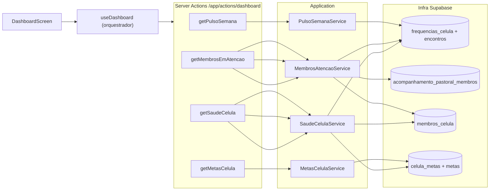
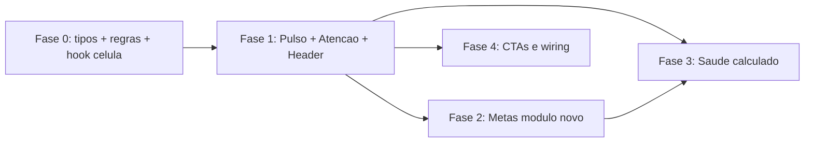

## Diagnóstico técnico

Auditoria do dashboard atual ([DashboardScreen.tsx](src/app/(private)/dashboard/components/DashboardScreen.tsx)):

- **5 cards 100% estáticos**: `MEMBROS_ATENCAO_MOCK`, `METAS_MOCK`, `PULSO_MOCK`, `score={85}` literal e callbacks `emBreve()`.
- **Único dado real hoje**: saudação no [DashboardHeader.tsx](src/app/(private)/dashboard/components/DashboardHeader.tsx) via `useAppAuthentication().loggedUser?.nome`.
- **Célula do líder** já está disponível: `loggedUser.celulaId` é hidratado em [auth.service.ts](src/modules/controleacesso/application/auth.service.ts) consultando `membros_celula` por papéis de liderança. Padrão idêntico ao usado em `/encontros` e `/membros`.

**Cobertura backend por card:**

- **Pulso da semana**: 100% coberto por `frequencias_celula` + `encontros` (já lidos por [EncontroRepository](src/modules/celulas/infra/encontro.repository.ts)).
- **Membros em Atenção**: 100% derivável de `frequencias_celula` + `acompanhamento_pastoral_membros` (sem regras prontas — heurísticas a propor).
- **Metas**: tabelas `metas` + `celula_metas` existem em [migrations/estrutura_inicial.sql](migrations/estrutura_inicial.sql) mas **não há nenhum código TS** consumindo. Módulo a criar do zero.
- **Saúde da célula (score)**: nenhuma tabela; cálculo derivado.
- **Ações rápidas**: lançar frequência redireciona para `/encontros` (fluxo existente); visitante e cadastrar membro precisam decisão de produto.



---

## Princípios da implementação

1. **Seguir Clean Architecture do projeto**: cada card = Domain → Service → Repository → Server Action → Hook → Componente.
2. **Filtrar SEMPRE por `loggedUser.celulaId`**, igual a [encontros/page.tsx](src/app/(private)/encontros/page.tsx) e [membros/page.tsx](src/app/(private)/membros/page.tsx).
3. **Tratamento de erro padrão**: `LoadingBox` / `ErrorBox`, sem `try/catch` em server actions, narrowing nos hooks.
4. **Heurísticas parametrizadas** em [src/app/(private)/dashboard/lib/regras.ts](src/app/(private)/dashboard/lib/regras.ts) — ajuste sem refatoração.
5. **Cards independentes**: cada um carrega/erra isoladamente. Falha do card de metas não derruba o de pulso.

---

## FASE 1 — Pulso, Membros em Atenção e Header (alta prioridade, dados existentes)

Cobre os cards mais valiosos para o líder e usa só tabelas/repositories já operantes.

### 1.1 Hook orquestrador da célula do líder

Novo arquivo: [src/app/(private)/dashboard/hooks/useDashboardCelula.ts](src/app/(private)/dashboard/hooks/useDashboardCelula.ts)

- Lê `celulaId` via `useAppAuthentication`.
- Retorna `{ celulaId, ready, semCelula }` — análogo ao guard usado em [useEncontros.ts](src/app/(private)/encontros/hooks/useEncontros.ts) (linhas 16–19) que define mensagem "Nenhuma célula vinculada foi encontrada".
- Centraliza a verificação para todos os cards.

### 1.2 Pulso da semana — módulo `dashboard` em `modules/celulas/application`

**Domain (já existe)**: reusa `Encontro` + `Frequencia` de [modules/celulas/domain](src/modules/celulas/domain).

**Novo serviço**: [src/modules/celulas/application/pulso-celula.service.ts](src/modules/celulas/application/pulso-celula.service.ts)

```ts
export type PulsoSemanaResult = {
  presencas: number;
  justificados: number;
  faltas: number;
  tendencia: { direcao: "subida" | "queda" | "estavel"; label: string; deltaPct: number };
  historicoFrequencia: number[]; // 5 últimos encontros
  ultimoEncontroData: string | null;
};
```

Lógica:
- Reusa `EncontroRepository.findByCelulaId(celulaId)` (já carrega `frequencias_celula` em embed).
- Pega os **5 encontros mais recentes ordenados por `data` desc**.
- Pulso = agregação do **encontro mais recente**: conta `presente=true`, `justificado=true`, `presente=false && justificado!=true`.
- `historicoFrequencia` = array de presenças por encontro (ordem cronológica asc).
- `tendencia`: compara média dos 2 últimos encontros vs 3 anteriores → `subida` se `deltaPct >= +5%`, `queda` se `<= -5%`, senão `estavel`. Label dinâmico ("queda leve", "subida forte", etc.) via tabela em `regras.ts`.

**Server Action**: [src/app/actions/dashboard/index.ts](src/app/actions/dashboard/index.ts) → `getPulsoSemana(celulaId)`.

**Hook**: [src/app/(private)/dashboard/hooks/usePulsoSemana.ts](src/app/(private)/dashboard/hooks/usePulsoSemana.ts) (loading/erro padrão).

**Componente**: [PulsoSemanaCard.tsx](src/app/(private)/dashboard/components/PulsoSemanaCard.tsx) ganha `loading?` e `erro?` opcionais; quando vazio (nenhum encontro), exibe estado "Sem encontros registrados ainda" com CTA "Lançar primeiro encontro".

### 1.3 Membros em Atenção — heurística parametrizável

**Tipo `Severidade` já existe** em [MembroAtencaoItem.tsx](src/app/(private)/dashboard/components/MembroAtencaoItem.tsx).

**Regras (parametrizáveis)** em [src/app/(private)/dashboard/lib/regras.ts](src/app/(private)/dashboard/lib/regras.ts):

```ts
export const REGRAS_ATENCAO = {
  critico: { faltasConsecutivas: 3, diasSemPastoreio: 35 },
  alerta:  { faltasConsecutivas: 2, diasSemPastoreio: 21 },
  observacao: { faltasConsecutivas: 1, diasSemPastoreio: 14 },
  janelaEncontros: 6, // últimos N encontros analisados
};
```

**Novo serviço**: [src/modules/celulas/application/atencao-celula.service.ts](src/modules/celulas/application/atencao-celula.service.ts)

Algoritmo por membro da célula (`MembrosCelulaRepository.findMembrosByCelulaId`):
1. Buscar últimos N encontros + suas `frequencias_celula` (reuso de `EncontroRepository`).
2. Calcular `faltasConsecutivas` (faltas não justificadas a partir do encontro mais recente até quebrar a sequência).
3. Buscar última `acompanhamento_pastoral_membros.data` para `membro_id` (reuso de `FrequenciaMembroRepository.findAcompanhamentosPastorais` ou novo método agregado).
4. Aplicar limiares → severidade. Sem nenhuma trigger → não retorna.
5. `motivos[]` é construído dinamicamente: `["3 faltas consecutivas", "Última ação registrada há 41 dias"]`.
6. Ordena por severidade desc.

**Server Action**: `getMembrosEmAtencao(celulaId)` em `actions/dashboard/index.ts`.

**Hook**: `useMembrosEmAtencao`.

**Componente**: [MembrosAtencaoCard.tsx](src/app/(private)/dashboard/components/MembrosAtencaoCard.tsx) já trata estado vazio. Adicionar loading/erro.

### 1.4 Header com timestamp real

[DashboardHeader.tsx](src/app/(private)/dashboard/components/DashboardHeader.tsx): trocar "Atualizado há poucos minutos" por valor real recebido via prop `atualizadoEm: Date | null`, calculado no `DashboardScreen` como o **maior `Date.now()` entre os fetches concluídos**. Formato relativo via helper simples (`agora`, `há 2 min`, `há 1 h`).

### 1.5 Refatoração do `DashboardScreen`

[DashboardScreen.tsx](src/app/(private)/dashboard/components/DashboardScreen.tsx):
- Remove os 3 mocks (`MEMBROS_ATENCAO_MOCK`, `METAS_MOCK`, `PULSO_MOCK`).
- Usa `useDashboardCelula()` → se `semCelula`, exibe `<ErrorBox>` global.
- Cada card passa a invocar seu próprio hook isolado.
- Mantém callbacks `emBreve` apenas para Fase 4 (ações rápidas).

---

## FASE 2 — Metas da Célula (módulo novo do zero)

Tabelas `metas`, `celula_metas`, `grupo_metas` existem em [migrations/estrutura_inicial.sql](migrations/estrutura_inicial.sql) mas **sem nenhum código TS**.

### 2.1 Validar schema atual

Antes de codar, validar via Supabase MCP se as colunas reais batem com a migration. Possíveis colunas que faltam para o card:
- `unidade` (texto: "BRL", "vidas", "casas") ou inferir por título.
- `formato` (enum: "moeda" | "numero").
- `periodo` (texto: "mensal" | "anual").

**Decisão pendente**: adicionar essas colunas ou inferir por convenção?

### 2.2 Novo módulo `modules/metas`

```
src/modules/metas/
├── domain/meta.ts                 # Meta (id, titulo, formato, unidade)
├── domain/celula-meta.ts          # CelulaMeta (celulaId, metaId, valorAtual, valorMeta, periodo)
├── application/dtos.ts            # MetaCelulaDto (achata para o card)
├── application/metas-celula.service.ts
├── application/mapper.ts
└── infra/metas-celula.repository.ts
```

Repositório: `findByCelulaIdNoPeriodoAtual(celulaId)` consulta `celula_metas` join `metas`, filtra `periodo` corrente.

### 2.3 Server Action + Hook + Componente

- Action: `getMetasCelula(celulaId)` em `actions/dashboard/index.ts`.
- Hook: `useMetasCelula`.
- Componente: [MetasCelulaCard.tsx](src/app/(private)/dashboard/components/MetasCelulaCard.tsx) já está pronto para receber `MetaCelula[]` reais — só plugar.
- Estado vazio: "Nenhuma meta cadastrada para o período. [Cadastrar meta]" — botão pode levar a rota futura `/metas` (stub na Fase 4).

**Nota**: CRUD de metas (cadastro/edição) **fora do escopo** deste plano. Apenas leitura.

---

## FASE 3 — Saúde da célula (score calculado)

Sem tabela; fórmula vive no domínio.

### 3.1 Fórmula proposta (parametrizada)

[src/app/(private)/dashboard/lib/regras.ts](src/app/(private)/dashboard/lib/regras.ts):

```ts
export const PESOS_SAUDE = {
  presenca: 0.5,    // taxa média de presença últimos 4 encontros
  pastoreio: 0.3,   // % de membros sem alerta crítico
  metas: 0.2,       // média de progresso das metas (cap 100%)
};

export const FAIXAS_SAUDE = [
  { min: 85, label: "Sua célula está florescendo, parabéns!", emoji: "florescendo" },
  { min: 70, label: "Sua célula está saudável", emoji: "saudavel" },
  { min: 50, label: "Sua célula precisa de atenção", emoji: "atencao" },
  { min: 0,  label: "Sua célula precisa de cuidado urgente", emoji: "critica" },
];
```

### 3.2 Serviço

[src/modules/celulas/application/saude-celula.service.ts](src/modules/celulas/application/saude-celula.service.ts)

- Recebe `celulaId`.
- Internamente compõe: `pulsoService.get(...)`, `atencaoService.list(...)`, `metasService.list(...)`.
- Retorna `{ score: number, mensagem: string, versiculo: string, classe: "florescendo" | ... }`.
- Versículo: array fixo em [src/app/(private)/dashboard/lib/versiculos.ts](src/app/(private)/dashboard/lib/versiculos.ts) sorteado por hash do dia + `celulaId` (estável dentro do dia).

### 3.3 Action + Hook + Componente

- Action: `getSaudeCelula(celulaId)`.
- [SaudeCelulaCard.tsx](src/app/(private)/dashboard/components/SaudeCelulaCard.tsx) já recebe `score`, `mensagem`, `versiculo` via props — só plugar.
- Estado loading: skeleton mantém gradient + esconde texto.

---

## FASE 4 — Ações rápidas e CTAs

Sem novos serviços; só wiring para fluxos existentes ou stubs claros.

### 4.1 Lançar frequência

`onLancarFrequencia` → `router.push("/encontros?novo=true")`. Em [encontros/page.tsx](src/app/(private)/encontros/page.tsx) ler `searchParams.novo` e abrir o modal de cadastro automaticamente.

### 4.2 Cadastrar membro / Registrar visitante

**Decisões pendentes** (sem implementação no plano até definir):
- Visitante: criar como `membro` simples + `membros_celula` com `papel_celula = VISITANTE`? Ou rota dedicada?
- Cadastrar membro: navegar para `/membros?novo=true` quando existir o modal? Hoje [membros/page.tsx](src/app/(private)/membros/page.tsx) tem botão "em breve".

Enquanto não decidido: manter `enqueueSnackbar("Em breve")` mas deixar TODOs marcados.

### 4.3 Header — "Atualizado em"

Plugar timestamp real (ver 1.4) com hook `useTempoRelativo` que re-renderiza a cada 60 s.

### 4.4 Membro em atenção — ações reais

Os botões de [MembroAtencaoItem.tsx](src/app/(private)/dashboard/components/MembroAtencaoItem.tsx) hoje são `emBreve`. Wiring proposto:
- "Enviar mensagem": `window.open(\`https://wa.me/${telefoneE164}?text=...\`)` usando `membro.telefone` (dado já existe em `membros`).
- "Ver ficha": `router.push(\`/membros?selected=\${membroId}\`)`.
- "Registrar pastoreio" / "Marcar acompanhado" / "Adiar 7 dias": precisam de Server Actions novas tocando em `acompanhamento_pastoral_membros` e numa tabela nova `dashboard_dispensas` (TODO Fase 5 ou decisão de produto).

---

## Dependência entre fases



A Fase 3 depende das 1 e 2 porque o score é composto. As Fases 2 e 4 são independentes entre si.

---

## Riscos e decisões pendentes

1. **Schema real do Supabase**: usar MCP para validar colunas de `metas`, `celula_metas` e `encontros` antes da Fase 2 (a migration pode estar desatualizada — ver `EncontroRepository` que assume colunas como `anfitriao`, `preletor` que não estão no SQL inicial).
2. **Tipos de meta** (moeda vs número): inferir por título (ex.: contém "oferta" → moeda) ou alterar schema?
3. **Severidade**: heurísticas propostas razoáveis mas precisam validação com líder real. Manter parametrizado em `regras.ts`.
4. **Janela do "pulso"**: encontro mais recente vs semana civil — proposta usa último encontro (mais útil pro líder pós-célula).
5. **Ações de membro em atenção** (registrar pastoreio, marcar acompanhado, adiar): exigem novas tabelas/colunas. Adiar requer estado persistido por (membroId, dataLimite). Bloqueia entrega completa do card 4.4.
6. **Performance**: 4 actions paralelas no dashboard. Considerar `Promise.all` no orquestrador ou um único endpoint agregador `getDashboard(celulaId)` se latência incomodar (decisão para Fase 1, depois de medir).
7. **Cache**: usar `unstable_cache` do Next ou React Query? Hoje o projeto usa hooks simples com `useState/useEffect` — manter padrão consistente.
8. **RLS**: validar que as policies do Supabase liberam leitura para o líder em todas as tabelas envolvidas (especialmente `celula_metas` que nunca foi tocada pelo app).