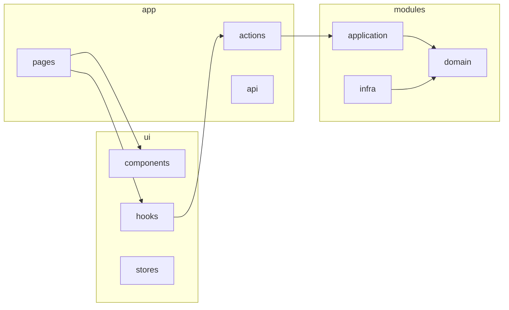

# Refatoração Full Stack e Módulo Membros (CRUD)

## Contexto

- **Banco (migrations):** A tabela `membros` tem: `id`, `user_id` (UUID FK `auth.users`), `data_nascimento`, `ativo`, `criado_em`, `criado_por`, `atualizado_em`, `atualizado_por`, `deletado`. Não há campo `nome` na tabela; nome/email vêm de `auth.users` via `user_id`.
- **Estado atual:** O frontend usa mock (`[src/features/membros/membros.service.ts](src/features/membros/membros.service.ts)` → axios para `/mocks/membros.json`) e tipos ricos (`[src/features/membros/types.ts](src/features/membros/types.ts)`) incompatíveis com o schema real. A estrutura atual (`features/`, `components/`, `store/` na raiz) não segue o AGENTS.md, que exige `modules/` e `ui/`.
- **Objetivo:** Alinhar à Clean Architecture, implementar o CRUD de membros em cima da tabela real e preparar o padrão para outros módulos.

---

## 1. Estrutura alvo (AGENTS.md)

- **modules/** — Domínio + Application + Infra por feature (sem React/Next/Supabase no domain/application).
- **ui/** — Componentes, hooks e stores (apresentação).
- **app/** — Rotas, Server Actions e API Routes (adapters que chamam use cases).

---

## 2. Refatoração da estrutura de pastas

| Ação                          | Detalhe                                                                                                                                            |
| ----------------------------- | -------------------------------------------------------------------------------------------------------------------------------------------------- |
| Criar `src/modules/`          | Um subdiretório por feature (começar por `membros`).                                                                                               |
| Criar `src/ui/`               | Mover `src/components/` → `src/ui/components/`, `src/store/` → `src/ui/stores/`. Manter `src/utils/` ou mover para `src/shared/` se fizer sentido. |
| Criar `src/app/actions/`      | Server Actions que chamam use cases (nada de regra de negócio aqui).                                                                               |
| Mover`src/features/supabase/` | Mover para `src/shared/supabase/` e passar a ser usado apenas por `modules/*/infra` e por `app/`.                                                  |
| Atualizar imports             | Todas as referências a `@/components/`, `@/store/` e `@/features/` devem apontar para os novos caminhos (`@/ui/...`, `@/modules/...`, etc.).       |

Impacto: layout, páginas (dashboard, encontros, membros, etc.), providers e qualquer arquivo que importe componentes ou store.

---

## 3. Módulo backend **membros**

### 3.1 Domain — `[src/modules/membros/domain/](src/modules/membros/domain/)`

- **Entidade:** `Membro` com: `id`, `userId` (UUID), `dataNascimento` (Date ou null), `ativo`, `criadoEm`, `criadoPor`, `atualizadoEm`, `atualizadoPor`, `deletado`. Apenas tipos e invariantes (ex.: `ativo` obrigatório).
- Sem dependências de React, Next ou Supabase.

### 3.2 Application — `[src/modules/membros/application/](src/modules/membros/application/)`

- **Use cases (CRUD básico):**
  - **ListMembros** — retorna lista (ex.: DTO com `id`, `userId`, `dataNascimento`, `ativo`, e opcionalmente `email`/`nome` para exibição).
  - **GetMembro** — por `id`.
  - **CreateMembro** — entrada: `userId`, `dataNascimento?`, `ativo`; preenche audit (`criado_por` = usuário logado).
  - **UpdateMembro** — entrada: `id` + campos alteráveis; preenche `atualizado_por`/`atualizado_em`.
  - **DeleteMembro** — soft delete (marcar `deletado`).
- Use cases não precisam importar interfaces. Podem importar MembroRepository diretamente da pasta /infra r
- **DTOs:** Definir tipos de entrada/saída dos use cases (ex.: `MembroListItemDto`, `MembroDetailDto`). Para listagem, incluir `email` (e se existir, `nome`) obtidos via `auth.users` ou view/RPC no Supabase, para não quebrar a UI atual que usa `membro.nome` / `membro.funcao`.

### 3.3 Infra — `[src/modules/membros/infra/](src/modules/membros/infra/)`

- **MembroRepository:** implementa métodos`save(membro)`, `findById(id)`, `findAll(filtros?)`, `delete(id)` (soft delete conforme `deletado` no schema). Usa `createClient()` do Supabase (server). Mapeamento: linha da tabela `membros` ↔ entidade `Membro`. Queries com `deletado = false` onde aplicável.
- Obter `email` (e nome, se houver) para listagem: usar Supabase (ex.: função RPC que retorna membros + dados de usuário, ou consulta a uma view que faça join com `auth.users` se o projeto permitir). Se no primeiro momento não houver view/RPC, o DTO pode expor só `userId` e a UI exibir “Usuário” ou o email quando já estiver disponível em outro fluxo.

### 3.4 Adapters (app)

- **Server Actions — `[src/app/actions/membros/](src/app/actions/membros/)`:**
  - `listMembros()`, `getMembro(id)`, `createMembro(dto)`, `updateMembro(id, dto)`, `deleteMembro(id)`.
  - Em cada action: obter sessão (ex.: `createClient().auth.getUser()`), extrair `criado_por`/`atualizado_por`, instanciar repositório e use case, chamar use case e retornar resultado serializável (sem funções ou símbolos).
- **API Routes (opcional):** Se precisar de API externa, criar em `app/api/membros/` (e possivelmente `app/api/membros/[id]/`) chamando os mesmos use cases.

---

## 4. Frontend — página Membros

- **Hook:** O hook da página de membros (ex.: `[src/app/(private)/membros/hooks/useMembros.ts](src/app/(private)`/membros/hooks/useMembros.ts) ou equivalente em `ui/hooks`) deve passar a chamar as Server Actions (ex.: `listMembros()`) em vez de `getMembros()` do mock.
- **Tipos de UI:** Criar tipos/DTOs de resposta das actions (ex.: `MembroListItemDto` com `id`, `userId`, `nome` ou `email`, `ativo`, `dataNascimento`, etc.) e usar na lista e no painel de detalhe. Manter compatibilidade com o que a UI já espera (`membro.nome`, `membro.funcao`) na medida do possível: por exemplo, `nome` = email ou “Usuário” até existir perfil/nome; `funcao` pode ser fixo ou vindo de outra tabela depois.
- **Remover:** Uso de `@/features/membros` (service e tipos antigos) na página e em hooks. Descontinuar o mock para membros (axios `/mocks/membros.json`).

---

## 5. Ordem sugerida de implementação

1. **Estrutura de pastas** — Criar `modules/`, `ui/`, `app/actions/` e mover componentes/store; ajustar imports em todo o projeto.
2. **Module membros (backend)** — Domain (entidade) → Application (use cases + DTOs) → Infra (`MembroRepository`).
3. **Adapters** — Server Actions de membros que chamam os use cases e obtêm usuário logado.
4. **Frontend membros** — Hook chamando actions, tipos alinhados aos DTOs, remoção do mock e de `features/membros` para essa tela.
5. **AGENTS.md** — Revisar seção de estrutura (ex.: menção a `shared/` para Supabase) e garantir que o documento reflita a estrutura final.

---

## 6. Pontos de atenção

- **Auditoria:** `criado_por` / `atualizado_por` devem vir do usuário autenticado (Server Action com Supabase `getUser()`).
- **Soft delete:** Listagem e demais operações devem filtrar `deletado = false`.
- **Nome/email na listagem:** A tabela `membros` não tem `nome`; a UI hoje usa `membro.nome` e `membro.funcao`. É necessário definir de onde vêm (auth.users, view, RPC ou placeholder) e documentar no DTO para não quebrar a tela.
- **Supabase:** Manter uso de `createClient()` server-side nas actions e no repositório; não expor chave de service no client.

---

## Resumo

- Refatorar pastas para `modules/`, `ui/` e `app/actions/` conforme AGENTS.md.
- Implementar o módulo **membros** com domain (entidade), application (use cases CRUD + DTOs) e infra (Supabase).
- Expor CRUD via Server Actions e conectar a página de membros a essas actions, substituindo o mock e alinhando tipos ao schema real e aos DTOs definidos no backend.

